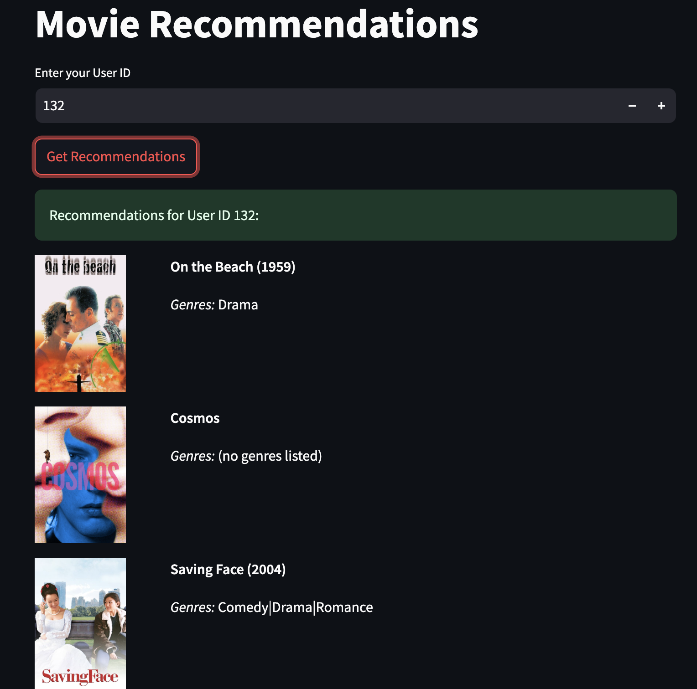

## 🔎 **Project Overview**

The goal of this project was to create a recommendation tool for movies that a user can interact with. To generate recommendations, I used Collaborative Filtering approach.  The final application is implemented using Streamlit and runs on a local server. 

## 🚀 **Usage**
The user can receive the Top-5 personal recommendations by providing their unique identifier.

## 🗃️ **Data**

I used the short version of [the MovieLens](https://grouplens.org/datasets/movielens/) database as the basis. I utilized the [TMDB API](https://developer.themoviedb.org/docs/getting-started) to fetch posters.

## 🤖 **Models**

 To generate recommendations, I used Collaborative Filtering algorithm already implemented in the ML Pyspark library.

### **Performance**

Root Mean Square Error (RMSE) were used to evaluate model quality. The RMSE  for predicting user ratings is 0.85. 

## 📂 Project background

The project was completed as part of my 7-month AI training bootcamp at BeCode in Ghent, Belgium.

## 👥 Contributors

- [Ihor Afanasiev](https://www.linkedin.com/in/ihor-afanasiev-a50798268/)
